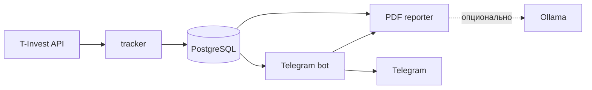

# FinanceTracker

Self-hosted сервис для учёта и анализа инвестиционного портфеля T‑Invest. Он регулярно сохраняет состояние портфеля, рассчитывает доходность и денежные потоки, а затем отправляет отчёты и уведомления в Telegram.

[](https://github.com/andrew-belikov/FinanceTracker/actions/workflows/ci.yml)
[](https://www.python.org/)
[](https://docs.docker.com/compose/)
[](https://www.postgresql.org/)

> Проект предназначен для личной аналитики и не совершает торговых операций. Его отчёты не являются инвестиционной рекомендацией.

## Возможности

- **История портфеля** — периодические снапшоты стоимости и состава портфеля в PostgreSQL.
- **Отчёты в Telegram** — сводки за день, неделю, месяц и год, история стоимости и структура активов.
- **Доходность** — TWR, XIRR, реализованный и нереализованный результат с корректным учётом внешних денежных потоков.
- **Денежные события** — купоны, дивиденды, комиссии, налоги, пополнения, выводы и налоговый вычет ИИС.
- **Планирование** — целевая аллокация, расчёт ребалансировки и распределение нового пополнения.
- **Календарь выплат** — ожидаемые купоны и объявленные дивиденды на ближайшие 90 дней.
- **Расширенные отчёты** — месячный PDF и ZIP-датасет для самостоятельного анализа.
- **Автоматические уведомления** — новые выплаты, пополнения, максимум портфеля и выполнение годового плана.

Основные команды бота: `/today`, `/week`, `/month`, `/monthpdf`, `/year`, `/history`, `/structure`, `/twr`, `/calendar`, `/targets`, `/rebalance`, `/invest` и `/dataset`.

## Архитектура



Система запускается одним Docker Compose-стеком:

- `tracker` получает данные T‑Invest и сохраняет снапшоты и операции;
- `bot` формирует отчёты, отвечает на команды и запускает рассылки;
- `reporter` собирает PDF, используя детерминированный fallback при недоступности Ollama;
- `migrate` применяет forward-миграции перед стартом прикладных сервисов;
- `xray-client` при необходимости предоставляет outbound proxy только для Telegram-бота;
- `db` хранит данные в отдельном Docker volume и не публикует порт на host.

Подробнее: [архитектура](docs/ARCHITECTURE.md) и [фактическое поведение](docs/BEHAVIOR.md).

## Быстрый старт

### Требования

- Docker Engine или Docker Desktop с Compose v2;
- токен Telegram-бота от [@BotFather](https://t.me/BotFather);
- токен T‑Invest API;
- Telegram user ID, которому разрешён доступ к боту.

### Запуск

1. Клонируйте репозиторий и перейдите в его каталог:

```bash
git clone https://github.com/andrew-belikov/FinanceTracker.git
cd FinanceTracker
```

2. Создайте локальную конфигурацию:

```bash
cp .env.example .env
${EDITOR:-vi} .env
```

Обязательно задайте:

```env
POSTGRES_PASSWORD=change-me
TELEGRAM_BOT_TOKEN=change-me
TINVEST_API_TOKEN=change-me
ALLOWED_USER_IDS=123456789
REPORTER_SERVICE_KEY=change-me-to-a-long-random-value
```

Для `REPORTER_SERVICE_KEY` используйте случайное значение длиной не менее 32 байт, например результат `openssl rand -hex 32`.

3. Создайте внешние Docker-ресурсы:

```bash
docker volume create financetracker_fintracker-db
docker network create localllm_localllm
```

Сеть нужна Compose-стеку даже при выключенной Ollama. Если volume или сеть уже существуют, повторно создавать их не нужно.

4. Соберите и запустите сервисы:

```bash
docker compose up -d --build --wait
```

5. Проверьте состояние и логи:

```bash
docker compose ps
docker compose logs --tail=100 tracker bot reporter
```

При запуске сервис `migrate` автоматически применит ещё не выполненные forward-миграции. Не используйте `docker compose down -v`, если хотите сохранить базу данных.

Полная инструкция по обновлению, резервному копированию, миграциям и диагностике находится в [операционном руководстве](docs/RUNBOOK.md).

## Конфигурация

Все параметры перечислены в [.env.example](.env.example) и подробно описаны в [docs/CONFIG.md](docs/CONFIG.md). Основные группы настроек:

- доступ к PostgreSQL, Telegram и T‑Invest API;
- расписание отчётов и уведомлений;
- правила выбора инвестиционного счёта;
- PDF reporter и опциональная Ollama;
- VLESS proxy для Telegram-трафика;
- тайм-ауты, лимиты и structured logging.

Доступ к боту ограничивается allowlist из `ALLOWED_USER_IDS`. Файл `.env` содержит секреты и не должен попадать в Git.

## Документация

| Документ | Содержание |
| --- | --- |
| [BEHAVIOR.md](docs/BEHAVIOR.md) | Команды бота, формулы, источники данных и fallback-поведение |
| [CONFIG.md](docs/CONFIG.md) | Переменные окружения и настройка сервисов |
| [RUNBOOK.md](docs/RUNBOOK.md) | Запуск, обновление, backup, миграции и диагностика |
| [ARCHITECTURE.md](docs/ARCHITECTURE.md) | Текущие сервисы и потоки данных |
| [TARGET_ARCHITECTURE.md](docs/TARGET_ARCHITECTURE.md) | Утверждённая целевая структура и границы модулей |
| [CONTRACTS.md](docs/CONTRACTS.md) | Нормативные контракты данных, интеграций и эксплуатации |
| [PDF_REPORT.md](docs/PDF_REPORT.md) | Состав и правила формирования месячного PDF |
| [LOGGING_STANDARD.md](docs/LOGGING_STANDARD.md) | Контракт structured logging |
| [CONTRIBUTING.md](CONTRIBUTING.md) | Локальная проверка и правила внесения изменений |

## Разработка

Проект использует Python 3.12, hash-locked зависимости и стандартный `unittest`. Полный локальный набор проверок:

```bash
python3 -m compileall src
python3 -m unittest discover -s tests -p 'test_*.py'
export APP_ENV_FILE=.env.example
export REPORTER_SERVICE_KEY=local_reporter_service_key_for_validation
docker compose --env-file "$APP_ENV_FILE" config --quiet
python3 scripts/verify_compose_env.py
python3 scripts/scan_secrets.py --history
```

Те же проверки выполняет GitHub Actions при каждом `push` и `pull_request`. Правила разработки и формат PR описаны в [CONTRIBUTING.md](CONTRIBUTING.md).
