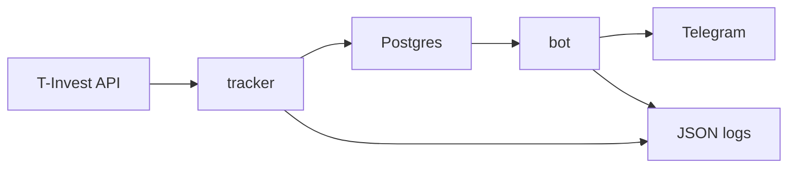

# Архитектура FinanceTracker

## Компоненты

- `db` хранит данные в Postgres.
- `tracker` опрашивает Invest API, сохраняет снапшоты и синхронизирует операции.
- `bot` читает данные из БД, отвечает в Telegram и отправляет автоматические сообщения.

## Поток Данных

1. `tracker` получает список счетов через `UsersService/GetAccounts`.
2. `tracker` выбирает один счёт.
3. `tracker` делает `GetPortfolio`, сохраняет или перезаписывает снапшот за локальный день `SCHED_TZ` и обновляет позиции.
4. `tracker` синхронизирует операции через `OperationsService/GetOperationsByCursor`.
5. `tracker` агрегирует купоны и дивиденды в `income_events`.
6. `bot` читает `portfolio_snapshots`, `portfolio_positions`, `operations`, `income_events`, формирует тексты и графики.
7. `bot` отправляет ответы на команды, ежедневные отчёты и уведомления.

## Lifecycle `tracker`

`tracker` запускается через [`src/tracker/app.py`](../src/tracker/app.py).

При старте он делает:

1. `init_db()` вызывает `Base.metadata.create_all(bind=engine)`.
2. Один раз выполняет `job_with_retry()` немедленно.
3. Поднимает APScheduler `BlockingScheduler`.
4. В зависимости от `SNAPSHOT_MODE` регистрирует:
   - `IntervalTrigger(minutes=SNAPSHOT_INTERVAL_MINUTES)`, либо
   - `CronTrigger(hour=SNAPSHOT_HOUR, minute=SNAPSHOT_MINUTE)`.
5. На каждом запуске джоба вызывает `run_snapshot_and_operations_once()`.

`run_snapshot_and_operations_once()` работает в два этапа:

1. Сначала создаёт или перезаписывает снапшот текущего дня.
2. Затем синхронизирует операции. Если этот этап падает, снапшот текущего дня всё равно остаётся сохранённым.

### Как `tracker` выбирает счёт

Логика `choose_account(...)` такая:

1. Если `TINKOFF_ACCOUNT_ID` задан и совпал с одним из `accounts[].id`, выбирается этот счёт.
2. Иначе выбирается первый счёт со статусом `ACCOUNT_STATUS_OPEN`.
3. Если открытых счетов нет, берётся просто первый из ответа API.

### Что пишет `tracker`

- `portfolio_snapshots`: агрегаты по портфелю на конкретную локальную дату `SCHED_TZ`.
- `portfolio_positions`: состав портфеля для конкретного снапшота.
- `instruments`: кэш названий и тикеров по `figi`.
- `operations`: upsert операций по `operation_id`.
- `income_events`: агрегированные события купонов и дивидендов для уведомлений и отчётов.

### Что считается идемпотентным

- Снапшот хранится один на `account_id + snapshot_date`; повторный запуск в тот же локальный день перезапишет агрегаты и позиции.
- Операции upsert-ятся по `operation_id` на уровне кода; на migrated-схеме может присутствовать дополнительная глобальная unique-констрейнт по `operation_id`.

## Lifecycle `bot`

`bot` запускается через [`src/bot/bot.py`](../src/bot/bot.py).

При старте он делает:

1. Проверяет, что задан `TELEGRAM_BOT_TOKEN`.
2. Создаёт `Application` из `python-telegram-bot`.
3. Регистрирует команды `/start`, `/help`, `/today`, `/week`, `/month`, `/year`, `/structure`, `/history`, `/twr`.
4. Проверяет наличие `app.job_queue`.
5. Планирует:
   - `run_daily(daily_job, time=18:00, tzinfo=container local time)`;
   - `run_repeating(check_income_events, interval=60, first=10)`;
   - опциональный `run_once(jobqueue_smoke_test_job, when=JOBQUEUE_SMOKE_TEST_DELAY_SECONDS)`.
6. Запускает polling через `app.run_polling()`.

### Что читает `bot`

- `portfolio_snapshots` и `portfolio_positions` для текстовых отчётов и графиков.
- `operations` для пополнений, комиссий, налогов, TWR и части годовых расчётов.
- `income_events` для купонов, дивидендов и уведомлений о зачислении доходов.
- `instruments` как источник названий и тикеров при отображении.

## Таблицы И Их Роль

### Основные runtime-таблицы

- `instruments`: справочник по `figi`, который `tracker` дозаполняет по мере необходимости.
- `portfolio_snapshots`: агрегаты портфеля на локальную дату `SCHED_TZ`.
- `portfolio_positions`: позиции внутри снапшота.
- `operations`: единый журнал операций счёта.
- `income_events`: агрегированные события купонов и дивидендов.

### Legacy / compatibility-объекты

- `deposits`: legacy-объект. После миграции `20260221_operations_from_deposits.sql` это view поверх `operations` и, при наличии, `deposits_legacy`.
- `deposits_legacy`: появляется только при миграции старой схемы и хранит историческую таблицу пополнений до перевода на `operations`.

Новый код не пишет в `deposits` и не читает пополнения из `deposits`. Основной источник данных для пополнений это `operations`.

## Время И Планировщики

### `tracker`

- APScheduler использует `SCHED_TZ`.
- `local_today()` тоже использует `SCHED_TZ`.
- Поэтому `snapshot_date` и сам факт "нового дня" в `tracker` привязаны к `SCHED_TZ`.

### `bot`

- Периоды `/today`, `/week`, `/month`, `/year`, а также локальные даты в `/twr` строятся через `TIMEZONE`.
- `snapshot_at` при показе в `/today` конвертируется в `TIMEZONE`.
- Ежедневный JobQueue запускается в `18:00` по локальному времени контейнера, а не по `TIMEZONE`.

Если `TIMEZONE=Europe/Moscow`, а контейнер живёт в UTC, тексты будут "по Москве", но авторассылки будут уходить в `18:00 UTC`.

## Structured Logging

Оба сервиса используют [`src/common/logging_setup.py`](../src/common/logging_setup.py):

- формат логов: JSON Lines в `stdout`;
- стабильные поля: `ts`, `level`, `service`, `env`, `logger`, `event`, `msg`;
- происходит sanitization токенов, Bearer-заголовков, паролей и Telegram bot token;
- `APP_ENV` и `APP_SERVICE` попадают в каждую запись.

Это значит, что штатный путь диагностики проекта это `docker compose logs ...`, а не файлы на диске.

## Clean Install Против Upgrade

### Clean install на пустую БД

Если база пустая, `tracker` создаёт таблицы через ORM и проект может работать без ручного применения SQL-миграций.

Что реально создаёт ORM:

- `instruments`
- `portfolio_snapshots`
- `portfolio_positions`
- `deposits`
- `operations`
- `income_events`

Это достаточно для текущего кода, но есть отличия от fully-migrated схемы:

- `deposits` будет таблицей, а не compatibility-view;
- `deposits_legacy` не появится;
- ручные DDL-детали из SQL-миграций, например глобальная unique-констрейнт по `operation_id`, не воспроизводятся автоматически.

### Upgrade существующей БД

SQL-миграции нужны, когда:

- уже есть старая таблица `deposits`, и нужно сохранить данные при переходе на `operations`;
- нужен compatibility-view `deposits` для старых SQL-запросов;
- требуется исторический backfill новых полей и legacy-compatible shape схемы;
- нужно получить дополнительные ручные ограничения из миграций.

### Миграции в репозитории

| Файл | Назначение |
| --- | --- |
| `migrations/20260221_operations_from_deposits.sql` | Переводит основную модель пополнений на `operations`, сохраняет старую таблицу как `deposits_legacy`, создаёт compatibility-view `deposits`. |
| `migrations/20260221_operations_from_deposits.rollback.sql` | Частичный rollback compatibility-слоя `deposits`. Не удаляет `operations`. |
| `migrations/20260225_operations_add_instrument_columns.sql` | Добавляет `instrument_uid` и `figi` в `operations`. |
| `migrations/20260226_income_events.sql` | Добавляет таблицу `income_events`. |
| `migrations/20260304_operations_operation_item_fields.sql` | Добавляет расширенные поля `OperationItem` и unique-констрейнт по `operation_id`. |

Подробный порядок применения и проверки смотрите в [docs/RUNBOOK.md](RUNBOOK.md).
