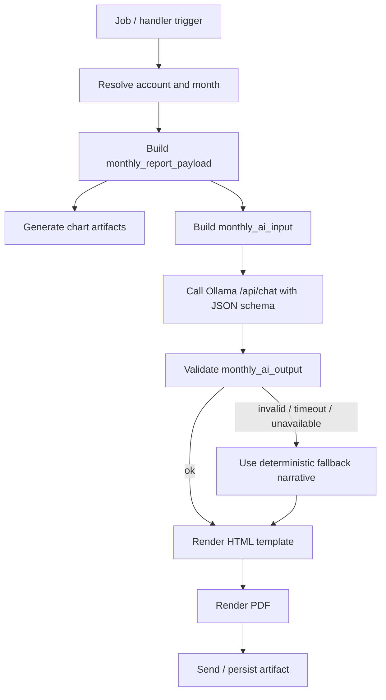

# PDF Report Technical Design

Документ фиксирует технический дизайн monthly PDF-отчёта для `FinanceTracker`.

Связанные документы:

- [PDF_REPORT.md](./PDF_REPORT.md)
- [PDF_REPORT_ROADMAP.md](./PDF_REPORT_ROADMAP.md)

Продуктовый состав страниц и контент-цели описаны в [PDF_REPORT.md](./PDF_REPORT.md).
Этот документ отвечает на вопросы:

- какие данные нужно собрать;
- какие данные нужно передать локальной модели;
- какой ответ нужно получить от модели;
- какие prompt-контракты нужны;
- как из всего этого собрать HTML и PDF;
- как деградировать, если AI или часть данных недоступны.

Первая целевая версия: `monthly review`.

## 1. Цели

- Считать все деньги, агрегаты, ранжирования и подписи детерминированно в коде проекта.
- Использовать `Ollama` только как narrative-layer поверх уже готовых фактов.
- Держать один канонический HTML-шаблон, пригодный и для PDF, и для будущего print-friendly web view.
- Вписаться в текущую архитектуру `src/bot/*` без крупного рефакторинга.
- Обеспечить graceful degradation: PDF обязан собираться и без `Ollama`.

## 2. Non-goals

- Не строить intraday-аналитику.
- Не переносить расчёт `PnL`, `TWR`, `rebalance` или классификацию операций в LLM.
- Не делать browser-side вызовы к `Ollama`.
- Не превращать monthly PDF в новый универсальный BI-движок.
- Не расширять `build_month_summary()` до PDF-конвейера.

## 3. Базовые принципы

### 3.1 Разделение на три контракта

Технически monthly report должен опираться на три разных сущности:

1. `monthly_report_payload`
   Полный детерминированный payload для графиков, таблиц, PDF-верстки и fallback-текстов.

2. `monthly_ai_input`
   Урезанный и нормализованный payload только для narrative generation.

3. `monthly_ai_output`
   Строго валидированный JSON-ответ от `Ollama`, который содержит только текстовые блоки.

Это критично: renderer и PDF не должны зависеть от того, что именно вернула модель.

### 3.2 Что делает код, а что делает модель

Код проекта делает:

- выбор периода и account;
- SQL-запросы;
- дедупликацию и нормализацию операций;
- склейку инструментов через `logical_asset_id`;
- расчёт всех денежных метрик;
- построение ranked lists;
- подготовку графиков;
- HTML-рендер;
- PDF-экспорт;
- fallback-тексты.

Модель делает только:

- заголовок отчёта;
- executive summary;
- краткие комментарии к графику performance;
- краткие выводы по инструментальной странице;
- заметки по cashflows / quality / risks.

### 3.3 Два уровня детальности данных

Полный payload нужен коду.
Сокращённый payload нужен модели.

Причины:

- полный render payload содержит больше деталей, чем нужно LLM;
- сырые ряды и длинные таблицы расходуют контекст и ухудшают стабильность ответа;
- модель должна интерпретировать уже посчитанные факты, а не выбирать их самостоятельно.

## 4. End-to-End Pipeline



## 5. Нюансы подключения на homeserver

Ниже зафиксирована реальная Docker-топология, проверенная на `homeserver` `2026-04-15`.
Это не абстрактная рекомендация, а observed deployment state.

### 5.1 Как поднята `Ollama`

На сервере `Ollama` поднята отдельным compose-проектом `localllm`:

- compose-файл: `/home/andrey/projects/LocalLLM/compose.yml`;
- контейнер: `localllm-ollama`;
- image: `ollama/ollama:latest`;
- внутренняя сеть: `localllm_localllm`;
- внутренний alias в сети: `ollama`;
- bind mount моделей: `/srv/data/localllm/ollama -> /root/.ollama`;
- healthcheck: `ollama list`;
- server-side `OLLAMA_HOST=0.0.0.0:11434`;
- host publish: `127.0.0.1:11434 -> 11434`.

Параллельно поднят `localllm-open-webui`, который ходит в `Ollama` по внутреннему адресу:

- `OLLAMA_BASE_URL=http://ollama:11434`

Это подтверждает, что canonical способ доступа внутри `localllm`-сети уже есть.

### 5.2 Как сейчас поднят `FinanceTracker`

`FinanceTracker` живёт в отдельном compose-проекте и отдельной bridge-сети:

- сеть: `financetracker_default`;
- контейнер `bot`: `financetracker-bot-1`;
- IP `bot` в этой сети: `172.18.0.4`;
- gateway этой сети: `172.18.0.1`.

`bot` сейчас не подключён к `localllm_localllm`.

### 5.3 Что уже проверено и что не работает

Изнутри `financetracker-bot-1` были проверены такие адреса:

- `http://172.18.0.1:11434/api/tags`
- `http://host.docker.internal:11434/api/tags`
- `http://ollama:11434/api/tags`
- `http://172.23.0.2:11434/api/tags`

Результат:

- `172.18.0.1:11434` — timeout;
- `host.docker.internal` — hostname не резолвится;
- `ollama` — hostname не резолвится;
- `172.23.0.2:11434` — timeout.

Вывод:

- текущая схема `bot -> localhost/host-gateway -> Ollama` в этой конфигурации нерабочая;
- текущая схема `bot -> ollama alias` тоже нерабочая, потому что контейнеры находятся в разных сетях;
- просто указать `OLLAMA_BASE_URL=http://localhost:11434` для `bot` нельзя.

### 5.4 Рекомендованный способ подключения на homeserver

Для этого сервера рекомендован такой путь:

1. Подключать не весь стек `FinanceTracker`, а только AI-потребителя к внешней сети `localllm_localllm`.
2. Использовать адрес `http://ollama:11434` как `OLLAMA_BASE_URL`.
3. Не публиковать `Ollama` наружу шире, чем сейчас, если в этом нет отдельной необходимости.

Практически это означает:

- либо подключить `bot` к внешней сети `localllm_localllm`;
- либо, что предпочтительнее, завести отдельный `reporter` service и подключить к этой сети только его.

Почему второй вариант лучше:

- меньше blast radius;
- AI/PDF-зависимости не смешиваются с обычным Telegram runtime;
- проще ограничивать ресурсы и рестарты отдельно от polling-бота.

### 5.5 Что стоит зафиксировать в будущем compose

Если monthly report будет вызываться из `bot`, в compose ему нужно добавить внешнюю сеть:

```yaml
services:
  bot:
    networks:
      - default
      - localllm

networks:
  localllm:
    external: true
    name: localllm_localllm
```

И после этого использовать:

```env
OLLAMA_BASE_URL=http://ollama:11434
```

То же правило применимо и к отдельному `reporter` service.

### 5.6 Что не рекомендовано для этого сервера

Не рекомендовано как основной путь:

- использовать `OLLAMA_BASE_URL=http://localhost:11434` внутри контейнера;
- рассчитывать на `host.docker.internal` без явной настройки;
- подключаться по IP другой Docker-сети;
- расширять bind `127.0.0.1:11434` до `0.0.0.0` только ради `FinanceTracker`.

Причины:

- это либо не работает в текущей схеме, либо ухудшает security profile;
- внутренняя Docker-сеть уже даёт более чистый и предсказуемый маршрут.

### 5.7 Ограничения текущего инстанса `Ollama`

На момент проверки у инстанса зафиксированы такие runtime-параметры:

- `OLLAMA_KEEP_ALIVE=10m`
- `OLLAMA_NUM_PARALLEL=1`
- `OLLAMA_MAX_LOADED_MODELS=1`

А в `api/tags` видна только одна модель:

- `qwen2.5:1.5b`

Практические последствия для техдизайна:

- не стоит рассчитывать на параллельную генерацию нескольких отчётов одновременно;
- narrative input должен быть компактным;
- repair-attempt должен быть максимум один;
- current model size подходит скорее для прототипа narrative-слоя, чем для “премиального” monthly PDF в production.

Для production-качества narrative стоит заранее держать возможность переключиться на более сильную локальную модель без изменения report pipeline.

## 6. Рекомендуемое размещение кода

Чтобы остаться в рамках текущей архитектуры `src/bot/*` и не конфликтовать с существующими sibling-imports, рекомендован минимально инвазивный набор модулей:

- `src/bot/report_payload.py`
  Канонический builder `monthly_report_payload`.
- `src/bot/report_ai.py`
  Сборка `monthly_ai_input`, вызов `Ollama`, валидация `monthly_ai_output`.
- `src/bot/report_render.py`
  Рендер HTML и экспорт PDF.
- `src/bot/report_pipeline.py`
  Оркестратор `payload -> AI -> HTML -> PDF`.
- `src/bot/templates/monthly_report.html.j2`
  Print-first HTML-шаблон.

Почему не стоит начинать с `src/bot/reporting/...`:

- текущий код явно придерживается плоских sibling-imports;
- так проще подключать новые модули из `handlers.py`, `jobs.py` и `bot.py`;
- это снижает риск случайно уехать в package-style imports, которых проект сознательно избегал при декомпозиции.

Поддиректория для шаблонов допустима, потому что `docker/Dockerfile.bot` копирует `src/bot/` целиком, включая вложенные каталоги.

## 7. Что уже есть в кодовой базе

### 7.1 Данные и builders, которые уже можно переиспользовать

Уже доступны:

- `build_dataset_export()` в `src/bot/dataset.py`
  Полезен как эталон структуры и data-quality-блоков.
- `build_month_summary()` в `src/bot/services.py`
  Полезен как human fallback, но не как payload builder.
- `compute_positions_diff_lines()` и `compute_positions_diff_grouped()` в `src/bot/services.py`
  Уже умеют сравнивать позиции начала и конца периода.
- `compute_twr_timeseries()` в `src/bot/services.py`
  Готовый TWR-ряд.
- `build_reconciliation_by_asset_type()` в `src/bot/services.py`
  Уже даёт useful quality / trust block.
- `get_month_snapshots()`, `get_period_snapshots()`, `get_positions_for_snapshot()`, `get_daily_snapshot_rows()`, `get_dataset_operations()`, `get_income_events_for_period()` в `src/bot/queries.py`
  Базовый data-access уже есть.
- `compute_realized_by_asset()`, `compute_income_by_asset_net()`, `get_unrealized_at_period_end()` в `src/bot/queries.py`
  Почти готовые ranked inputs для страницы по инструментам.
- `get_latest_rebalance_snapshot()` и `compute_rebalance_plan()` в `src/bot/services.py`
  Уже позволяют построить structured rebalance block.

### 7.2 Чего не хватает

Нужно добавить или собрать поверх существующих функций:

- отдельный `monthly_report_payload`, а не markdown builder;
- query для `instrument_eod_timeseries` по всем релевантным snapshot месяца;
- структурный `position_flow_groups` с value-дельтой, а не только текстовыми линиями;
- `operations_top` как ranked list для страницы cashflows;
- `monthly_ai_input` и `monthly_ai_output` контракты;
- HTML template layer;
- PDF renderer;
- AI fallback strategy.

## 8. Данные, которые нужно собрать

### 8.1 Полный `monthly_report_payload`

Это главный детерминированный объект. Он должен строиться кодом один раз, затем использоваться:

- renderer'ом;
- AI-layer'ом;
- fallback narrative builder'ом;
- тестами;
- при необходимости экспортом в debug JSON.

Рекомендуемая корневая форма:

```json
{
  "schema_version": "monthly_report_payload.v1",
  "meta": {},
  "summary_metrics": {},
  "timeseries_daily": [],
  "positions_current": [],
  "positions_month_start": [],
  "positions_month_end": [],
  "position_flow_groups": {},
  "instrument_eod_timeseries": [],
  "instrument_movers": {},
  "realized_by_asset": [],
  "income_by_asset": [],
  "open_pl_end": [],
  "operations_top": [],
  "income_events": [],
  "reconciliation_by_asset_type": [],
  "data_quality": {},
  "rebalance_snapshot": {}
}
```

### 8.2 Правила сериализации

Внутри Python-пайплайна можно держать:

- `Decimal`;
- `date`;
- `datetime`;
- typed dict / dataclass.

Но сериализованная версия payload должна кодироваться так:

- денежные суммы и проценты: строками;
- даты: ISO `YYYY-MM-DD`;
- datetime: ISO 8601 UTC;
- идентификаторы инструментов: уже после нормализации;
- `None` допускается только там, где отсутствие данных действительно легально.

Это позволяет:

- избежать float drift;
- получить стабильные snapshot-тесты;
- безопасно передавать payload в `Ollama`.

### 8.3 Состав `meta`

`meta` должен содержать:

- `report_kind`: `monthly_review`;
- `account_id`;
- `account_friendly_name`;
- `timezone`;
- `currency`;
- `period_year`;
- `period_month`;
- `period_label_ru`;
- `period_start`;
- `period_end`;
- `generated_at_utc`;
- `has_ai_narrative`;
- `data_schema_version`;

Опционально:

- `source_snapshot_start_id`;
- `source_snapshot_end_id`;
- `source_snapshot_count`;
- `notes`.

### 8.4 Состав `summary_metrics`

Обязательные поля:

- `start_value`;
- `end_value`;
- `current_value`;
- `period_pnl_abs`;
- `period_pnl_pct`;
- `period_twr_pct`;
- `net_external_flow`;
- `deposits`;
- `withdrawals`;
- `income_net`;
- `coupon_net`;
- `dividend_net`;
- `commissions`;
- `taxes`;
- `deposits_ytd`;
- `plan_annual_contrib`;
- `plan_progress_pct`;
- `target_to_date`;
- `reconciliation_gap_abs`;
- `positions_value_sum`;
- `top_holding_name`;
- `top_holding_value`;
- `top_holding_weight_pct`;
- `best_day_date`;
- `best_day_pnl`;
- `worst_day_date`;
- `worst_day_pnl`;
- `income_events_count`;

Часть этих полей уже считается в коде.
Часть удобнее вывести поверх `timeseries_daily`.

### 8.5 Состав `timeseries_daily`

Назначение:

- страница `Performance`;
- best/worst day;
- локальные max/min;
- подписи к графику;
- AI-commentary по ходу месяца.

Минимальный состав строки:

- `date`;
- `snapshot_id`;
- `snapshot_at_utc`;
- `portfolio_value`;
- `expected_yield`;
- `expected_yield_pct`;
- `deposits`;
- `withdrawals`;
- `income_net`;
- `commissions`;
- `operation_taxes`;
- `income_taxes`;
- `net_cashflow`;
- `day_pnl`;
- `twr_pct`.

Источник:

- дневной EOD ряд по `portfolio_snapshots`;
- агрегаты по операциям и income events поверх него.

### 8.6 Состав позиций на начало, конец и current

Нужны три списка:

- `positions_month_start`;
- `positions_month_end`;
- `positions_current`.

`positions_current` в monthly v1 обычно совпадает с `positions_month_end`, но выделять его отдельно полезно для future-proofing.

Строка позиции должна содержать:

- `logical_asset_id`;
- `asset_uid`;
- `instrument_uid`;
- `figi`;
- `ticker`;
- `name`;
- `instrument_type`;
- `quantity`;
- `currency`;
- `position_value`;
- `expected_yield`;
- `expected_yield_pct`;
- `weight_pct`.

### 8.7 Состав `position_flow_groups`

Назначение:

- блок `Новые / Закрытые / Докупили / Сократили`.

Рекомендуемая форма:

```json
{
  "new": [],
  "closed": [],
  "increased": [],
  "decreased": []
}
```

Строка должна содержать:

- `logical_asset_id`;
- `ticker`;
- `name`;
- `instrument_type`;
- `start_qty`;
- `end_qty`;
- `delta_qty`;
- `start_value`;
- `end_value`;
- `delta_value`;

Алгоритм:

- взять start snapshot до начала месяца;
- взять end snapshot внутри месяца;
- склеить позиции по `logical_asset_id`;
- если `logical_asset_id` недоступен, использовать fallback:
  - `asset_uid`;
  - `instrument_uid`;
  - `figi`;
  - `ticker`;
- разложить пары по четырём группам.

### 8.8 Состав `instrument_eod_timeseries`

Это главный недостающий блок для `Instruments Deep Dive`.

Назначение:

- честный `EOD-only` взгляд на инструменты в течение месяца;
- расчёт `Top growth` и `Top drawdown`;
- при желании будущие sparkline.

Рекомендуемый состав строки ряда:

- `date`;
- `snapshot_id`;
- `logical_asset_id`;
- `asset_uid`;
- `instrument_uid`;
- `figi`;
- `ticker`;
- `name`;
- `instrument_type`;
- `quantity`;
- `position_value`;
- `expected_yield`;
- `expected_yield_pct`;
- `weight_pct`.

Рекомендуемая форма payload:

```json
[
  {
    "logical_asset_id": "asset-1",
    "ticker": "EQMX",
    "name": "EQMX",
    "instrument_type": "etf",
    "series": [
      {
        "date": "2026-04-01",
        "snapshot_id": 123,
        "quantity": "10",
        "position_value": "12345.67",
        "expected_yield": "345.67",
        "expected_yield_pct": "2.88",
        "weight_pct": "5.42"
      }
    ],
    "stats": {
      "eod_min_position_value": "12000.00",
      "eod_min_position_value_date": "2026-04-03",
      "eod_max_position_value": "14000.00",
      "eod_max_position_value_date": "2026-04-21",
      "eod_end_position_value": "13900.00",
      "eod_min_expected_yield": "-420.00",
      "eod_min_expected_yield_date": "2026-04-08",
      "eod_max_expected_yield": "730.00",
      "eod_max_expected_yield_date": "2026-04-29",
      "eod_end_expected_yield": "620.00",
      "max_rise_abs": "1150.00",
      "max_drawdown_abs": "-980.00"
    }
  }
]
```

Алгоритм построения:

1. Выбрать по одному последнему snapshot на каждый день месяца.
2. Загрузить `portfolio_positions` для этих snapshot.
3. Присвоить каждой строке `logical_asset_id`.
4. Сгруппировать по `logical_asset_id`.
5. Отсортировать точки по дате.
6. Рассчитать локальные min/max и итоговые значения.
7. На основе `stats` собрать `instrument_movers`.

Важно:

- это не intraday;
- изменения в ряду зависят и от рынка, и от сделок;
- именно поэтому в PDF нужно явно писать `end-of-day trajectory within month`.

### 8.9 Состав `instrument_movers`

Этот блок удобнее собирать отдельно поверх `instrument_eod_timeseries`, чтобы renderer и AI не считали его сами.

Рекомендуемая форма:

```json
{
  "top_growth": [],
  "top_drawdown": []
}
```

Строка должна содержать:

- `logical_asset_id`;
- `ticker`;
- `name`;
- `metric_kind`;
- `rise_abs` или `drawdown_abs`;
- `start_date`;
- `end_date`;
- `end_expected_yield`;
- `end_expected_yield_pct`.

Для monthly MVP основной рейтинг лучше строить по `expected_yield` в рублях.
`expected_yield_pct` полезен как вторичная колонка.

### 8.10 Состав `realized_by_asset`, `income_by_asset`, `open_pl_end`

Это три ranked lists для блока `Contribution To Result`.

`realized_by_asset`:

- источник: продажи;
- метрика: `sum(yield + commission)` по sell-операциям;
- поля:
  - `logical_asset_id`;
  - `figi`;
  - `ticker`;
  - `name`;
  - `amount`.

`income_by_asset`:

- источник: dividend / coupon и связанные tax строки;
- поля:
  - `logical_asset_id`;
  - `figi`;
  - `ticker`;
  - `name`;
  - `amount`;
  - `income_kind`.

`open_pl_end`:

- источник: end snapshot;
- поля:
  - `logical_asset_id`;
  - `ticker`;
  - `name`;
  - `amount`;
  - `amount_pct`.

Важно:

- `compute_realized_by_asset()` уже полезен, но это не lot-based cost basis;
- `open_pl_end` не равно месячному вкладу в результат;
- эти три списка не должны сливаться в одну общую метрику.

### 8.11 Состав `operations_top`

Страница `Cashflows & Data Quality` не должна рендерить весь список операций месяца.
Нужен короткий ranked list.

Рекомендуемые поля:

- `date_utc`;
- `local_date`;
- `operation_type`;
- `operation_group`;
- `logical_asset_id`;
- `ticker`;
- `name`;
- `amount`;
- `quantity`;
- `description`;

Рекомендуемый лимит:

- `10-20` строк в full payload;
- `5-10` строк в AI input.

Рекомендуемое ранжирование:

- по `abs(amount)` по убыванию;
- с приоритетом для `deposit`, `withdrawal`, `sell`, `buy`, `commission`.

### 8.12 Состав `income_events`

Нужны поля:

- `event_date`;
- `event_type`;
- `logical_asset_id`;
- `figi`;
- `ticker`;
- `instrument_name`;
- `gross_amount`;
- `tax_amount`;
- `net_amount`;
- `net_yield_pct`;
- `notified`.

Пустое состояние допустимо.

### 8.13 Состав `reconciliation_by_asset_type` и `data_quality`

`reconciliation_by_asset_type`:

- `instrument_type`;
- `positions_value_sum`;
- `snapshot_total`;
- `delta_abs`.

`data_quality`:

- `unknown_operation_group_count`;
- `mojibake_detected_count`;
- `positions_missing_label_count`;
- `has_full_history_from_zero`;
- `income_events_available`;
- `asset_alias_rows_count`;
- `has_rebalance_targets`;

Это нужно не только для appendix.
Это ещё и trust-layer для всего отчёта.

### 8.14 Состав `rebalance_snapshot`

Даже если ребаланс не будет центральной частью monthly v1, его стоит включить в payload.

Рекомендуемая форма:

```json
{
  "snapshot_date": "2026-04-30",
  "rebalanceable_base": "430000.00",
  "rows": [
    {
      "asset_class": "etf",
      "label": "ETF",
      "current_value": "120000.00",
      "current_pct": "27.9",
      "target_pct": "21.3",
      "delta_pct": "6.6",
      "target_value": "91500.00",
      "delta_value": "-28500.00",
      "status": "вне нормы"
    }
  ],
  "other_groups": []
}
```

Источник:

- `get_latest_rebalance_snapshot()`;
- `compute_rebalance_plan()`.

## 9. Какие данные передавать локальной модели

### 9.1 Не передавать full render payload

В `Ollama` не нужно отправлять:

- полный список ежедневных рядов по каждому инструменту;
- весь список операций за месяц;
- сырые SQL-строки;
- уже отрендеренный HTML;
- графические бинарные артефакты;
- длинные markdown/text blobs из `build_month_summary()`.

Причины:

- это расходует context window;
- провоцирует модель на самостоятельные расчёты;
- делает ответ менее стабильным и хуже валидируемым.

### 9.2 Нужен отдельный `monthly_ai_input`

Рекомендуемая корневая форма:

```json
{
  "schema_version": "monthly_ai_input.v1",
  "meta": {},
  "overview_facts": {},
  "performance_facts": {},
  "structure_facts": {},
  "position_flow_facts": {},
  "mover_facts": {},
  "contribution_facts": {},
  "cashflow_facts": {},
  "quality_facts": {}
}
```

### 9.3 Что включать в `monthly_ai_input`

`meta`:

- `period_label_ru`;
- `account_friendly_name`;
- `currency`;
- `timezone`;
- `style`: `calm precise non-promotional`.

`overview_facts`:

- ключевые summary-метрики страницы 1;
- best / worst day;
- top holding;
- 3-5 основных факт-строк.

`performance_facts`:

- `period_twr_pct`;
- `period_pnl_abs`;
- `period_pnl_pct`;
- `best_day`;
- `worst_day`;
- `portfolio_peak`;
- `portfolio_trough`;
- 5-7 точек или already-computed highlights, а не весь raw series.

`structure_facts`:

- top holdings `5-10`;
- структура по классам активов;
- концентрация топ-3;
- biggest weight.

`position_flow_facts`:

- топ новых;
- топ закрытых;
- топ увеличенных;
- топ сокращённых.

`mover_facts`:

- top growth `3-5`;
- top drawdown `3-5`;
- realized winners / losers `3-5`;
- income contributors `3-5`;
- open P/L leaders `3-5`.

`cashflow_facts`:

- top operations `5-10`;
- total deposits / withdrawals;
- income totals;
- commissions;
- taxes.

`quality_facts`:

- reconciliation gap;
- quality counters;
- alias caveats;
- missing blocks.

### 9.4 Формат данных для модели

Для AI input желательно:

- денежные значения уже предформатировать строками, которые можно безопасно цитировать;
- даты тоже предформатировать в одном стиле;
- ограничить длинные массивы top-N;
- не передавать больше одного представления одного и того же факта.

Пример:

- либо `period_pnl_abs: "-3 342 ₽"`;
- либо `period_pnl_abs_value: "-3342.09"` и `period_pnl_abs_display: "-3 342 ₽"`;
- но не десяток разных округлений одной суммы.

Для narrative generation лучше использовать именно display-oriented значения.

### 9.5 Ограничение размера input

Нужно предусмотреть hard limit, например `OLLAMA_MAX_INPUT_CHARS`.

Политика сокращения при превышении лимита:

1. Сократить `operations_top`.
2. Сократить `top positions`.
3. Сократить `mover_facts`.
4. Убрать вторичные explanatory notes.
5. Никогда не выкидывать `overview_facts`, `quality_facts`, `risk`-сигналы.

## 10. Какой ответ нужен от локальной модели

### 10.1 Общие требования

Нужен только JSON.
Никакого markdown.
Никакого prose до или после JSON.

Рекомендуемый корневой объект:

```json
{
  "schema_version": "monthly_ai_output.v1",
  "report_title": "",
  "executive_summary": [],
  "performance_commentary": [],
  "instrument_takeaways": [],
  "cashflow_notes": [],
  "quality_notes": [],
  "risk_notes": [],
  "warnings": []
}
```

### 10.2 Ограничения по каждому полю

`report_title`:

- 1 строка;
- до `90` символов;
- без чисел, которых нет в input.

`executive_summary`:

- `3-4` bullets;
- каждый до `220` символов;
- только факты верхнего уровня.

`performance_commentary`:

- `3-5` bullets;
- каждый до `180` символов;
- поясняют график, а не пересказывают весь месяц.

`instrument_takeaways`:

- `4-6` bullets;
- смесь rotation / movers / contribution;
- без мнимой причинности там, где у нас только snapshot truth.

`cashflow_notes`:

- `0-3` bullets;
- только если есть meaningful cashflow pattern.

`quality_notes`:

- `0-3` bullets;
- только если есть reconciliation gap, missing labels, weak aliases или иные quality flags.

`risk_notes`:

- `2-4` bullets;
- только про риски, аномалии и caveats.

`warnings`:

- optional;
- для пометки мест, где модель сознательно не смогла сделать вывод.

### 10.3 Что модели запрещено

Модели запрещено:

- придумывать новые числа;
- пересчитывать проценты;
- делать суммирование по сырым данным;
- использовать термины `intraday`, `candle`, `точка входа`, если данных для этого нет;
- делать инвестиционные рекомендации;
- писать в рекламном или motivational стиле.

### 10.4 Дополнительная semantic validation

Помимо проверки структуры, полезно валидировать смысл ответа.

Минимальный post-check:

- извлечь все числа, проценты и даты из `monthly_ai_output`;
- сравнить их с whitelist значений, которые присутствуют в `monthly_ai_input`;
- если модель выдала новые числа, которых не было во входе, считать ответ спорным.

Практическое правило:

- schema-valid, но semantic-invalid ответ не должен ломать pipeline;
- он переводит отчёт на deterministic fallback narrative.

## 11. Какие prompt-контракты нужны

### 11.1 Почему стоит использовать native `Ollama` API

Для v1 рекомендован прямой вызов `POST /api/chat`, а не OpenAI-совместимый слой.

Причины:

- официальный `chat` endpoint документирует `format` как `json` или JSON schema;
- там же есть `stream`, `keep_alive` и runtime `options`;
- это самый короткий путь к structured output без лишней клиентской обвязки.

Официальные страницы:

- [Ollama API /api/chat](https://docs.ollama.com/api/chat)
- [Ollama Structured Outputs](https://docs.ollama.com/capabilities/structured-outputs)
- [Ollama Context Length](https://docs.ollama.com/context-length)
- [Ollama API introduction](https://docs.ollama.com/api/introduction)

### 11.2 Рекомендуемый request shape

```json
{
  "model": "qwen3:8b",
  "stream": false,
  "keep_alive": "15m",
  "format": {
    "type": "object"
  },
  "messages": [
    {
      "role": "system",
      "content": "..."
    },
    {
      "role": "user",
      "content": "..."
    }
  ],
  "options": {
    "temperature": 0,
    "num_ctx": 16384
  }
}
```

Примечания:

- `temperature=0` снижает креативный шум;
- `stream=false` упрощает валидацию;
- `keep_alive` полезен для пачки прогонов;
- `num_ctx` должен быть конфигурируемым, потому что больший context требует больше памяти, что отдельно отмечено в официальной документации по context length.

### 11.3 System prompt

Рекомендуемый system prompt:

```text
Ты пишешь narrative-блоки для monthly PDF-отчёта по инвестиционному портфелю.
Пиши только на русском языке.
Ты не считаешь финансовые метрики и не придумываешь новые числа.
Используй только факты из входного JSON.
Если факта не хватает, не додумывай его и помести короткую пометку в warnings.
Стиль: спокойный, точный, не рекламный, без пафоса, без инвестиционных советов.
Верни только JSON, который соответствует заданной схеме.
```

### 11.4 User prompt

Рекомендуемый user prompt-шаблон:

```text
Собери narrative-блоки для monthly PDF-отчёта.

Правила:
1. Не придумывай новые числа, проценты, даты или причины движения.
2. Не делай intraday-утверждений: данные только end-of-day.
3. Не давай советов и прогнозов.
4. Если данных недостаточно, запиши короткое предупреждение в warnings.
5. Поля executive_summary, performance_commentary, instrument_takeaways, cashflow_notes, quality_notes, risk_notes возвращай как массивы коротких bullets.
6. Не добавляй markdown.

Схема ответа:
<вставить JSON schema>

Входные факты:
<вставить monthly_ai_input как JSON>
```

### 11.5 Repair prompt

Если ответ не проходит schema или semantic validation, допустима одна repair-attempt.

Рекомендуемый repair prompt:

```text
Предыдущий ответ не подходит.

Проблемы:
- <список ошибок валидации>

Верни JSON заново.
Не меняй факты и не добавляй новые числа.
Исправь только структуру и спорные формулировки.
```

После одной неудачной repair-attempt нужно переходить на deterministic fallback.

## 12. Как собирать отчёт

### 12.1 Шаг 1. Resolve периода и account

На входе pipeline должны быть:

- `account_id`;
- `year`;
- `month`;
- `timezone`.

Если `account_id` не задан явно:

- использовать текущий reporting account через `resolve_reporting_account_id()`.

### 12.2 Шаг 2. Build `monthly_report_payload`

Оркестратор `report_payload.py` должен:

1. Собрать start/end snapshots.
2. Собрать daily portfolio series.
3. Собрать позиции начала и конца периода.
4. Построить `position_flow_groups`.
5. Собрать `instrument_eod_timeseries`.
6. Построить `instrument_movers`.
7. Собрать `realized_by_asset`, `income_by_asset`, `open_pl_end`.
8. Собрать `operations_top`, `income_events`.
9. Собрать `reconciliation_by_asset_type`, `data_quality`.
10. При наличии таргетов добавить `rebalance_snapshot`.
11. Посчитать derived summary metrics.

### 12.3 Шаг 3. Построить chart artifacts

Лучше генерировать графики отдельными image-артефактами до HTML render.

Рекомендуемые артефакты monthly v1:

- `performance_chart.png`
  Портфель по дням + cashflow / day PnL.
- `allocation_chart.png`
  Структура по классам активов.

Опционально:

- `movers_sparklines/*.png`
  Только если позже появится потребность.

### 12.4 Шаг 4. Построить `monthly_ai_input`

`report_ai.py` должен извлечь из full payload только нужные narrative facts.
Именно здесь нужно:

- ограничивать top-N;
- форматировать display-значения;
- строить whitelist чисел для post-validation;
- убирать шумные поля.

### 12.5 Шаг 5. Вызвать `Ollama`

Если `OLLAMA_ENABLED=false`:

- сразу использовать deterministic fallback narrative.

Если `OLLAMA_ENABLED=true`:

- отправить запрос в `/api/chat`;
- ожидать только schema-bound JSON;
- поставить таймаут;
- выполнить schema validation;
- выполнить semantic validation;
- при неудаче сделать одну repair-attempt;
- затем либо принять narrative, либо включить fallback.

На `homeserver` этот шаг должен использовать сетевой маршрут:

- `OLLAMA_BASE_URL=http://ollama:11434`

но только после подключения AI-потребителя к внешней сети `localllm_localllm`.
Без этого `bot` не увидит `Ollama`.

### 12.6 Шаг 6. Render HTML

HTML template должен получать:

- full `monthly_report_payload`;
- `monthly_ai_output` или fallback narrative;
- chart artifact manifest.

Шаблон не должен:

- считать метрики;
- сортировать данные;
- выбирать top-N;
- самостоятельно форматировать сырой `Decimal`.

Шаблон должен только раскладывать уже подготовленные display blocks по страницам.

### 12.7 Шаг 7. Render PDF

Для monthly v1 рекомендован `WeasyPrint`.

Почему:

- отчёт статический и print-first;
- JS не нужен;
- нужен контроль page breaks, headers, footers и `@page`;
- это проще и стабильнее, чем тащить полноценный Chromium ради одного документа.

Нужные зависимости:

- `Jinja2`;
- `WeasyPrint`;
- системные библиотеки для Cairo/Pango.

Сохранить abstraction всё равно стоит:

- `report_render.py` должен экспортировать интерфейс уровня `render_monthly_pdf(...)`;
- это позволит позже заменить backend на Playwright, если web/print слой станет сложнее.

### 12.8 Шаг 8. Доставка

В MVP достаточно:

- сохранить PDF во временный файл;
- отправить его в Telegram из `jobs.py` или отдельного handler;
- после отправки удалить временную директорию.

Полезно дополнительно сохранять:

- промежуточный HTML в debug-режиме;
- `monthly_report_payload.json` в debug-режиме;
- но не сохранять сырые AI prompts и ответы по умолчанию.

## 13. Renderer и CSS-контракт

HTML/CSS для PDF должен быть print-first.

Обязательные требования:

- `A4 portrait`;
- явные `@page` margins;
- управляемые `page-break-before` и `break-inside: avoid`;
- predictable font stack;
- таблицы без тяжёлых рамок;
- один главный визуальный блок на страницу;
- подписи к графикам, а не отдельные тяжёлые legend-boxes.

Шаблон должен использовать уже подготовленные display strings:

- `477 207 ₽`;
- `-0,78 %`;
- `06.04.2026`.

Это снижает количество форматирующей логики в template layer.

## 14. Fallback и деградация

### 14.1 Когда отчёт всё равно должен собраться

PDF обязан собираться, если:

- `Ollama` недоступна;
- модель вернула невалидный JSON;
- не хватает данных для части блоков;
- нет income events;
- нет rebalance targets.

### 14.2 Что скрывать точечно

Если нет нужных данных:

- скрыть `Position Flow`, если нет пары start/end snapshots;
- скрыть `Intramonth Movers`, если недостаточно EOD-рядов;
- показывать empty-state для income events;
- скрыть rebalance subsection, если нет targets.

### 14.3 Deterministic fallback narrative

Нужно предусмотреть простой builder, который без LLM генерирует:

- `report_title`;
- `executive_summary`;
- `performance_commentary`;
- `instrument_takeaways`;
- `cashflow_notes`;
- `quality_notes`;
- `risk_notes`.

Он может использовать короткие шаблоны на основе уже посчитанных ranked lists.

Главное требование:

- fallback narrative должен быть сухим, но корректным;
- LLM улучшает читаемость, но не нужен для работоспособности.

## 15. Логирование и observability

В логах должны быть только служебные метаданные.
Сырые prompts и свободный текст ответа логировать не нужно.

Рекомендуемые события:

- `monthly_report_payload_built`
- `monthly_report_ai_requested`
- `monthly_report_ai_completed`
- `monthly_report_ai_validation_failed`
- `monthly_report_ai_fallback_used`
- `monthly_report_html_rendered`
- `monthly_report_pdf_rendered`
- `monthly_report_send_failed`

Рекомендуемые поля `ctx`:

- `report_kind`;
- `period`;
- `account_id`;
- `model`;
- `payload_bytes`;
- `input_chars`;
- `response_valid`;
- `fallback_used`;
- `hidden_blocks`;
- `duration_ms`.

## 16. Планируемые env-переменные

Эти параметры стоит добавить в `docs/CONFIG.md` только вместе с кодовой реализацией.
На момент написания документа это проектируемые значения, а не уже поддерживаемая конфигурация.

Для AI:

- `OLLAMA_ENABLED`
- `OLLAMA_BASE_URL`
- `OLLAMA_MODEL`
- `OLLAMA_TIMEOUT_SECONDS`
- `OLLAMA_KEEP_ALIVE`
- `OLLAMA_NUM_CTX`
- `OLLAMA_MAX_INPUT_CHARS`

Для renderer:

- `REPORT_PDF_ENGINE`
- `REPORT_DEBUG_SAVE_HTML`
- `REPORT_DEBUG_SAVE_PAYLOAD`

Для `homeserver` рекомендуемое значение после сетевой интеграции:

- `OLLAMA_BASE_URL=http://ollama:11434`

И отдельное напоминание:

- `localhost` внутри `financetracker-bot-1` не указывает на `localllm-ollama`.

## 17. Основные риски

### 17.1 Data risks

- `asset_aliases` работают best-effort, поэтому часть истории может склеиваться неидеально;
- `realized_by_asset` не является полной lot-based моделью;
- `open_pl_end` отражает состояние на конец периода, а не вклад за месяц;
- `instrument_eod_timeseries` будет `EOD-only`.

### 17.2 LLM risks

- локальная модель может выдумывать причинность;
- слабые модели нестабильны на длинных prompt'ах;
- ответ может быть schema-valid, но semantic-invalid.
- при `OLLAMA_NUM_PARALLEL=1` параллельные запросы будут упираться в сериализацию или очередь.

### 17.3 Rendering risks

- PDF backend добавит системные зависимости;
- chart sizing и page breaks нужно будет стабилизировать тестовыми примерами.

## 18. Рекомендуемая последовательность внедрения

### Этап 1. Детерминированный payload и HTML без AI

- собрать `monthly_report_payload`;
- добавить `instrument_eod_timeseries`;
- сверстать HTML;
- печатать PDF с deterministic fallback narrative.

### Этап 2. Подключить `Ollama`

- добавить `monthly_ai_input`;
- добавить `monthly_ai_output` schema;
- добавить request / validation / repair / fallback.
- подключить AI-потребителя к сети `localllm_localllm`;
- настроить `OLLAMA_BASE_URL=http://ollama:11434`.

### Этап 3. Доставка и эксплуатация

- интегрировать генерацию в `jobs.py`;
- добавить ручной trigger;
- отладить debug artifacts и logging.

### Этап 4. Future work

- print-friendly web view поверх того же HTML layout;
- richer chart set;
- yearly report на том же каркасе.

## 19. Короткий итог

Правильная архитектура monthly PDF для этого проекта выглядит так:

- `queries/services/charts` продолжают считать всё важное;
- новый `monthly_report_payload` становится единым deterministic source of truth;
- в `Ollama` уходит только сокращённый `monthly_ai_input`;
- от модели ожидается только `monthly_ai_output` в строгом JSON;
- HTML и PDF собираются без вычислений внутри template layer;
- при любом сбое AI отчёт всё равно собирается на fallback-текстах.
