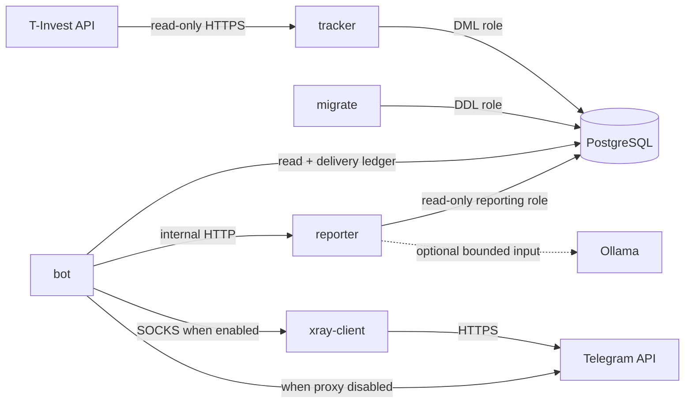
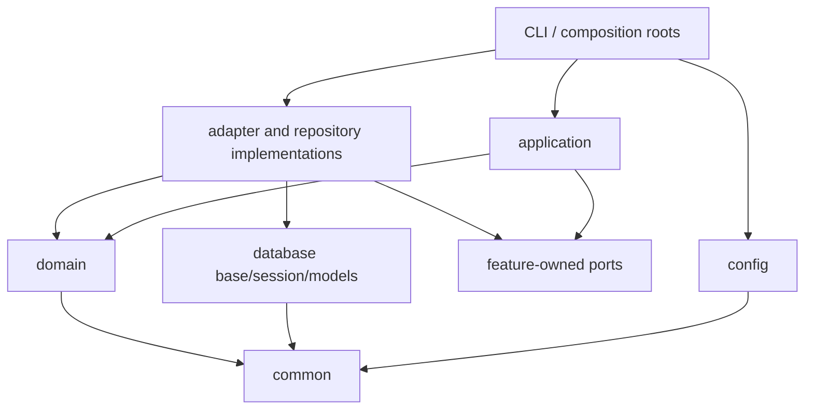
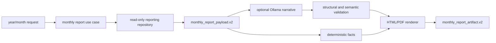

# Целевая архитектура FinanceTracker

Статус: нормативная цель рефакторинга

Дата решения: 2026-09-15

Исходная ветка реализации: `refactor`

## Как читать документ

Этот документ описывает целевое состояние, а не текущую реализацию. Текущее
production-устройство до завершения миграции описывает
[`ARCHITECTURE.md`](ARCHITECTURE.md), целевые инварианты и их lifecycle —
[`CONTRACTS.md`](CONTRACTS.md). [`PROJECT_AUDIT.md`](PROJECT_AUDIT.md) является
датированным planning snapshot с backlog и исходной последовательностью работ,
но не operational runbook.

Пункт считается реализованным только после изменения кода, прохождения
соответствующих проверок и обновления документации текущего состояния.

## Архитектурное решение

FinanceTracker остаётся модульным монолитом в одном репозитории и разворачивается
одним Docker Compose-проектом. Код оформляется как один устанавливаемый
namespace-пакет `financetracker`; runtime-роли собираются в отдельные образы из
одного исходного дерева.

Не создаются отдельные репозитории, отдельная БД для каждого модуля, общий RPC
data-service или новый async-стек. Физическая изоляция применяется только там,
где уже существует самостоятельная runtime-ответственность: ingestion,
Telegram delivery, PDF rendering, migrations и proxy.

## Цели

- отделить чистые финансовые правила от SQLAlchemy, Telegram, HTTP и env;
- сделать ownership данных, транзакций и внешних side effects явным;
- устранить зависимость кода от flat Docker copy layout;
- сохранить пользовательское поведение и числовую эквивалентность;
- собирать и проверять каждый runtime-образ до production;
- обеспечить контролируемое обновление без big-bang migration.

## Не-цели

- переписывание на другой язык или framework;
- переход на микросервисы ради структуры каталогов;
- замена синхронного SQLAlchemy или HTTP server одновременно с переносом кода;
- изменение финансовых формул без отдельного behavior-change решения;
- изменение Telegram-команд, Compose service names или внешнего DB volume в
  рамках механического рефакторинга;
- выполнение торговых операций: интеграция T-Invest остаётся read-only.

## Целевая runtime-топология



Поддерживаемые runtime-роли:

| Роль | Ответственность | Постоянные side effects |
| --- | --- | --- |
| `db` | единственный system of record | PostgreSQL external volume |
| `migrate` | сериализованное изменение схемы | DDL и migration ledger |
| `tracker` | read-only ingestion из T-Invest | portfolio, operations, payouts |
| `bot` | Telegram-команды, расписание и delivery | job/delivery ledgers |
| `reporter` | monthly payload, narrative и PDF | отсутствуют, кроме bounded debug opt-in |
| `xray-client` | изолированный Telegram proxy | отсутствуют |

Reporter сохраняет собственный read-only доступ к PostgreSQL. Это позволяет ему
полностью владеть построением отчёта и сохраняет текущий компактный HTTP-запрос
`year/month`. Альтернатива с передачей полного финансового payload из bot
отклонена: она возвращает reporting queries в bot, расширяет чувствительный
межсервисный контракт и создаёт два владельца reporting pipeline.

Renderer и narrative adapters БД не видят: application layer сначала получает
данные через reporting repository и создаёт неизменяемый payload, после чего
передаёт его чистому renderer.

## Целевая структура пакета

```text
src/financetracker/
├── common/
│   ├── logging.py
│   ├── readiness.py
│   ├── time.py
│   └── text.py
├── config/
│   ├── database.py
│   ├── tracker.py
│   ├── bot.py
│   ├── reporter.py
│   └── xray.py
├── domain/
│   ├── money.py
│   ├── portfolio.py
│   ├── cashflows.py
│   ├── performance.py
│   ├── payouts.py
│   └── rebalance.py
├── database/
│   ├── base.py
│   ├── session.py
│   ├── models/
│   └── migrations/
│       └── runner.py
├── tracker/
│   ├── ports.py
│   ├── application/
│   │   ├── snapshot_sync.py
│   │   ├── operations_sync.py
│   │   └── payout_sync.py
│   ├── infrastructure/
│   │   ├── tinvest_client.py
│   │   └── postgres.py
│   ├── scheduler.py
│   ├── healthcheck.py
│   └── cli.py
├── reporting/
│   ├── contracts.py
│   ├── ports.py
│   ├── application/
│   │   └── monthly_report.py
│   ├── payload/
│   ├── infrastructure/
│   │   └── postgres.py
│   ├── rendering/
│   │   ├── charts.py
│   │   ├── html.py
│   │   └── pdf.py
│   ├── narrative/
│   │   ├── deterministic.py
│   │   └── ollama.py
│   ├── http/
│   │   └── server.py
│   └── cli.py
├── bot/
│   ├── ports.py
│   ├── application/
│   │   ├── summaries.py
│   │   ├── notifications.py
│   │   ├── datasets.py
│   │   └── commands.py
│   ├── telegram/
│   │   ├── handlers.py
│   │   ├── jobs.py
│   │   ├── transport.py
│   │   └── composition.py
│   ├── infrastructure/
│   │   └── postgres.py
│   ├── reporter_client.py
│   ├── supervisor.py
│   ├── healthcheck.py
│   └── cli.py
└── xray/
    ├── config.py
    ├── supervisor.py
    ├── healthcheck.py
    └── cli.py
```

Это карта ownership, а не требование создавать пустые файлы. Модуль появляется
только вместе с конкретной ответственностью и тестируемым контрактом.

## Ответственность слоёв

### `common`

Только технические примитивы: structured logging, readiness state, безопасная
работа с текстом и базовые функции времени. Модуль не содержит финансовых
правил, не читает env и не создаёт clients.

### `config`

Immutable settings, строгий разбор env и startup validation по runtime-роли.
Импорт config-модуля не открывает сеть и не создаёт DB engine. Composition root
явно передаёт settings потребителям.

### `domain`

Чистые типы и функции портфеля, денег, cashflows, performance, payouts и
rebalance. Здесь запрещены SQLAlchemy, Telegram, HTTP, Docker и чтение env.

### `database`

Единственный владелец `Base`, ORM models, engine/session factories и migration
runner. Модуль предоставляет технический механизм PostgreSQL, но не владеет
семантикой feature-specific queries.

### `tracker`

Владеет T-Invest adapter, ingestion use cases, repository ports и их PostgreSQL
реализациями, retry policy чтения, scheduler и readiness tracker. Не импортирует
`bot` или `reporting`.

### `reporting`

Владеет versioned reporting payloads, repository ports и их read-only PostgreSQL
реализациями, deterministic narrative, optional Ollama adapter, HTML/PDF
rendering и internal HTTP API. Rendering принимает готовый payload и не
открывает DB session.

### `bot`

Владеет Telegram authorization, commands, presentation, scheduling, delivery
leases, repository ports/implementations и transport. Application use cases не
принимают типы Telegram SDK. Monthly PDF запрашивается только через documented
reporter client.

### `xray`

Инфраструктурный sidecar для Telegram traffic. Зависит только от собственных
settings и технических модулей `common`; не импортирует bot-код.

## Правила зависимостей



Обязательные запреты:

- `domain` не импортирует `database`, `tracker`, `bot`, `reporting` или `xray`;
- `common` не импортирует product/application слои;
- `tracker` не импортирует `bot` или `reporting`;
- `reporting` не импортирует `bot` или `tracker`;
- `bot` не импортирует внутренние reporting modules, только reporter contract;
- renderer не импортирует repositories, sessions или HTTP server;
- migration runner не импортирует tracker application;
- application не импортирует concrete infrastructure adapters;
- импорт любого модуля не должен создавать engine, scheduler или HTTP client.

Правила контролируются AST/import-boundary test в CI.

## Application и composition roots

Application service:

- принимает явные зависимости;
- задаёт одну понятную транзакционную границу;
- зависит от feature-owned ports/protocols, а не от concrete adapters;
- возвращает domain/result object;
- не форматирует Telegram или HTTP response;
- не читает env и не создаёт глобальные clients.

Composition root находится только в `cli.py` или server startup. Он читает
settings, создаёт engine, repositories и adapters, связывает их и запускает
application service.

Целевые console entrypoints:

```text
financetracker-tracker
financetracker-bot
financetracker-reporter
financetracker-migrate
financetracker-tracker-healthcheck
financetracker-bot-healthcheck
financetracker-reporter-healthcheck
financetracker-xray
financetracker-xray-healthcheck
```

Старые file entrypoints могут существовать только как временные forwarding
adapters и не содержат собственной логики.

## Данные и транзакции

PostgreSQL остаётся единственным system of record. Feature владеет repository
port и семантикой use case; concrete PostgreSQL implementation находится в
`<feature>/infrastructure/postgres.py`. Общий `database` владеет только engine,
sessions, models и migration mechanism. Владение данными дополнительно
ограничивается DB roles:

- migrator: DDL и migration ledger;
- tracker: запись ingestion-данных;
- bot: чтение, job/delivery ledgers, `rebalance_targets` и явно разрешённые
  manual поля операций/уведомлений;
- reporter: read-only reporting views/tables.

Транзакция принадлежит application use case. Repository не делает скрытый
`commit`, если это явно не является полным атомарным use case. Долгий внешний
HTTP-запрос не выполняется внутри открытой DB-транзакции.

Подробные правила схемы, idempotency и delivery находятся в
[`CONTRACTS.md`](CONTRACTS.md).

## Reporting pipeline



Один отчёт строится внутри одной read-only `REPEATABLE READ` транзакции и имеет
явный `as_of`/source snapshot cutoff. Поэтому все queries видят согласованный
PostgreSQL snapshot, даже если tracker продолжает запись параллельно.

Ollama не рассчитывает финансовые показатели и не изменяет deterministic facts.
Невалидный или недоступный AI-path всегда заканчивается детерминированным
fallback, а не недоступностью PDF.

## Сети и trust boundaries

Целевая сеть задаётся явно для каждого сервиса; implicit default network не
используется.

| Сеть | Участники | Назначение |
| --- | --- | --- |
| `db_internal` | db, migrate, tracker, bot, reporter | PostgreSQL с разными roles |
| `reporter_internal` | bot, reporter | authenticated internal HTTP |
| `proxy_internal` | bot, xray-client | SOCKS endpoint для Telegram |
| `tracker_egress` | tracker | только T-Invest HTTPS |
| `telegram_egress` | зависит от выбранного режима | только Telegram HTTPS |
| `ollama_internal` | reporter, optional Ollama | bounded narrative request |

Режимы egress являются взаимоисключающими Compose profiles/overrides:

- proxy disabled: egress получает bot, xray-client отсутствует или работает в
  изолированном idle-режиме;
- proxy enabled: egress получает только xray-client, а bot состоит только в
  `proxy_internal`, DB и reporter networks.

Для proxy-enabled режима отрицательный тест обязан доказывать отсутствие direct
Telegram bypass из bot. DB, reporter и SOCKS port не публикуются на host. Xray
не состоит в DB или Ollama network. Reporter service key остаётся вторым рубежом
поверх internal network. Для реального egress enforcement применяется host
firewall или специализированный egress proxy: Docker network сама по себе не
задаёт адресный allowlist внешнего трафика.

## Secrets и runtime privileges

Общий `.env` является только временным compatibility path. Целевое состояние:

- per-service secret files с `*_FILE` contract;
- Telegram token доступен только bot;
- T-Invest token доступен только tracker;
- VLESS links доступны только xray-client;
- reporter key доступен только bot и reporter;
- DB credentials разделены по DDL/read/write ролям;
- first-party containers работают non-root;
- root filesystem read-only, writable paths перечислены явно;
- capabilities удалены, `no-new-privileges` включён;
- `/tmp` ограничен tmpfs и resource limits заданы явно.

## Build и deploy

```mermaid
flowchart LR
    SOURCE[source SHA] --> CI[controlled reproducible CI]
    CI --> TESTS[tests and container smoke]
    TESTS --> BUILD[build once]
    BUILD --> REGISTRY[images by digest]
    REGISTRY --> MANIFEST[signed release manifest]
    MANIFEST --> VERIFY[verify and pull candidate plus previous images]
    VERIFY --> PREFLIGHT[image and schema preflight]
    PREFLIGHT --> BACKUP[verified pre-deploy backup]
    BACKUP --> MIGRATION[exact-digest migrate]
    MIGRATION --> START[start candidate]
    START --> ACCEPT[acceptance]
    ACCEPT --> RECEIPT[immutable acceptance receipt]
```



`Hermetic` здесь заменяется более точной целью: controlled reproducible
build-once CI. Все source/dependency inputs фиксируются; OS packages берутся из
закреплённого snapshot repository или проверяются по digest/checksum; network
доступ ограничен отдельной fetch-фазой.

Production runner не собирает source и не исполняет build steps из ветки. Он
получает подписанный release manifest, проверяет допустимые signer/issuer,
repository, workflow identity, ref, registry и связанные SBOM/provenance
digests, заранее получает candidate и previous images, создаёт backup, запускает
точный migrator digest и только затем переключает application images.

Deployable unit:

```text
source SHA
+ image digest каждой runtime-роли
+ schema manifest version и digest
+ config schema version
+ CI run identity
```

Подписанный release manifest существует до deploy. Post-deploy acceptance
создаёт отдельный immutable receipt и ссылается на manifest; эти артефакты не
подменяют друг друга.

## Стратегия перехода

1. Добавить golden, PostgreSQL integration и container smoke tests.
2. Создать package skeleton и абсолютные импорты без изменения логики.
3. Вынести `Base`, models, engine/session factories и migration runner.
4. Изолировать reporting payload, repository, renderer и HTTP service.
5. Разделить tracker на T-Invest adapter и ingestion use cases.
6. Разделить queries по use cases и транзакционным границам.
7. Оставить Telegram handlers/jobs тонкими adapters.
8. По одному переключить образы: reporter, tracker/migrate, bot, xray.
9. Удалить forwarding entrypoints и `sys.path` compatibility только после
   успешного переключения всех consumers.
10. Закрыть runtime hardening и build-once/deploy-by-digest.
11. Time storage переведён отдельной migration
    `20260915_timezone_aware_utc.sql` на timezone-aware contract: legacy
    `TIMESTAMP WITHOUT TIME ZONE` явно интерпретируется как UTC, compatibility
    view `deposits` пересоздаётся в одной транзакции. Финансовый pipeline
    переводится на end-to-end `Decimal` отдельным schema/behavior срезом с
    собственным preflight, backfill/dual-read при необходимости и
    production-derived acceptance; он не смешивается с механическим переносом
    модулей.

Каждый шаг является отдельным проходящим коммитом. Механический перенос,
изменение финансового поведения и смена operational contract не объединяются.

## Целевая структура документации

После извлечения устойчивых знаний документация разделяется по назначению:

```text
README.md
docs/
├── index.md
├── active/
│   ├── architecture.md
│   ├── operations.md
│   ├── configuration.md
│   ├── backup-restore.md
│   ├── rollback.md
│   ├── incident-response.md
│   ├── security.md
│   └── slo.md
├── reference/
│   ├── behavior.md
│   ├── contracts.md
│   ├── database-schema.md
│   ├── migrations.md
│   ├── logging.md
│   └── reporter-api.md
├── adr/
│   ├── 0001-modular-monolith.md
│   ├── 0002-postgresql-system-of-record.md
│   ├── 0003-forward-only-migrations.md
│   ├── 0004-time-and-money.md
│   ├── 0005-network-and-secrets.md
│   ├── 0006-reporting-boundary.md
│   └── 0007-build-once-deploy-by-digest.md
└── archive/
    ├── audits/
    ├── reviews/
    └── completed-plans/
```

- `active` отвечает на вопрос «как система работает и эксплуатируется сейчас»;
- `reference` содержит стабильные технические и продуктовые контракты;
- `adr` объясняет принятые решения, альтернативы и последствия;
- `archive` хранит датированные свидетельства и планы с banner `status`,
  `as-of`, `source SHA` и `superseded-by`.

Существующие файлы не перемещаются, пока стабильные сведения не извлечены и все
ссылки не обновлены одним атомарным изменением. `PROJECT_AUDIT.md`, завершённые
roadmap/decomposition документы и исторические code review после этого не
остаются активными инструкциями.

## Definition of Done

Целевая архитектура достигнута, когда:

- runtime использует installable package и console entrypoints;
- отсутствуют sibling imports и изменение `sys.path`;
- dependency-boundary tests запрещают обратные зависимости;
- domain calculations не зависят от SQLAlchemy, Telegram, HTTP и env;
- migration runner не импортирует tracker application;
- reporter не импортирует bot modules, а renderer не видит DB;
- tracker, bot и reporter используют отдельные DB roles;
- Compose service names, health semantics и внешний volume сохранены либо
  изменены отдельным утверждённым operational contract;
- DB-dependent образы проходят PostgreSQL integration, все образы — build и
  runtime smoke, а полный Compose — cross-service acceptance до production;
- production-derived acceptance подтверждает числовую эквивалентность;
- current-state документация обновлена после фактического переключения;
- active/reference/ADR/archive разделены, а исторические документы явно
  помечены и не выглядят действующими инструкциями.
